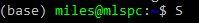
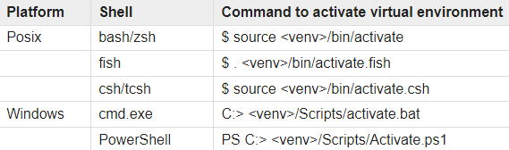
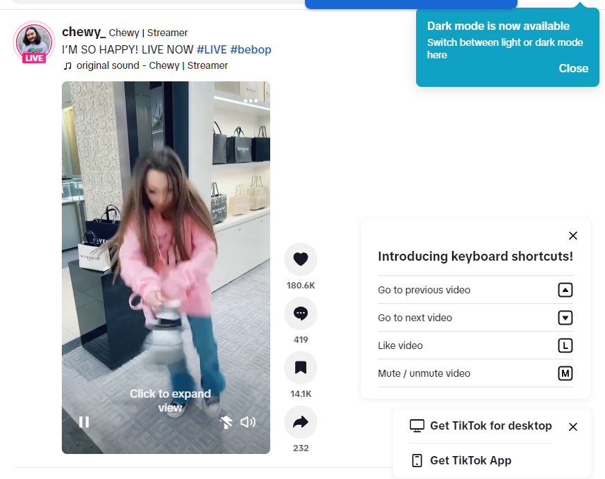

# tiktok-like-experiment
CS315 project testing how likes affect a user's recommendation algorithm using Selenium.

By: Miles Mezaki, Sandy Liu, Sarah Goldman, Caroline Jung, Johanna Lee, Audrey Liang

##### The TikTok audit code is in the PageTiktok.py file in the page_objects folder. chrome_audit has not been updated.

## (2/12 Update!)
We realized that when new accounts are made, it only takes a few batches to reach the end of the "for you" page and thus we get an error in the ```update_batch()``` code. So we added code that calls ```update_batch()``` only when we know we haven't reached the end of the "for you" page. 

## (2/11 New!)
#### Assumes you have cloned this repo and setup the environment. If not, read the instructions in ```How to run code```
### New testing method
1. navigate into tests/tiktok. you will notice that there are two test files now, ```test_active.py``` and ```test_control.py```
2. Open test_active.py <br>
    - replace ```scenario_num``` with your scenario number (1-6)
    - replace the last initial (JL) in ```username``` with your intial, and scenario number (Sc1) with your scenario number. 
3. Open test__control.py <br>
    - ***Don't replace scenario_num_1***, because -1 means we're running the control
    - only replace the last initial (JL) with your intial, and scenario number (Sc1) in ```username```  

### How to run active/control user at the same time
1. Open ***TWO*** terminals on vscode and split it for better view <br>

2. Run this command first
```
# active user
python -m pytest tests/tiktok/test_active.py --html=report_active.html
```
3. Login with your ***active tiktok user***. 
4. Go back to the vscode terminal. Run this command on the other terminal.
```
# control user
python -m pytest tests/tiktok/test_control.py --html=report_control.html
```
3. Login with your ***control tiktok user***. 
4. Now just wait!

### Explaining the csv files
The csv files have a new naming method. 
```
{scenario_num}_{username}_{current_time}_{filename}
```
- scenario_num (1-6), -1 means control
- username: Sec02Gr2Sc1Activ_JL format.
- current_time: time you ran test
- file_name = like_by_hashtag_all_videos (this is fixed for this experiment)


## How to Run the Code
### 1. Clone the Repository
You should be able to clone the repository by running
```
git clone https://github.com/mlsmzk/tiktok-like-experiment
```
or by cloning manually on GitHub Desktop.

### 2. Open VS Code
2. Activate conda's base environment (should show ```(base)``` before your directory in your terminal)

    

### 3. cd to Repository
Next, change your working directory to the repository you cloned. This is different from opening the folder in VS Code, though you can change directories through the terminal in VS Code.

On Windows it will look something like this:
    

and on Mac/Linux the directory will be different but the command `cd` will stay the same. If you're confused, we recommend starting with `cd ~` (root directory) and locating the repository from there. With any luck, you'll remember where you cloned the repository and might even be able to copy the path.

### 4. Create a virtual environment
Next you will want to create a virtual environment. This can be done through Python's own venv library, or using the [easily installable virtualenv library](https://techinscribed.com/python-virtual-environment-in-vscode/). The next steps will cover installation through Python's built-in library.
    
**a.** Open a terminal, either zsh on Mac or PowerShell on Windows. You may need to **run the terminal as administrator/root user** if this is your first time creating a virtual environment. 

**b.** Run the command 
    
    python -m venv .venv

This will create a directory called `.venv` (you can change the name if you like). This directory is useful because it contains its own python version and package manager. This means that when activated, the python version you use is located in .venv rather than your global python version. Furthermore, any packages installed while the venv is activated will only be accessible in the virtual environment. This is especially helpful with version conflicts, but shouldn't be an issue if you're a newer Python user or don't have other projects in Python.

**c.** Activate the virtual environment. This command varies between platforms. On Windows, it is
        
    .venv/Scripts/activate

and on Mac/Linux the command should be

    source .venv/bin/activate

Here is a list of ways to activate if your shell is different than the default:



**d.** To turn off the virtual environment once you are done, it should suffice to type `deactivate` into your terminal.


### 5. Install Required Packages
Next you'll need Selenium and other important packages. Luckily, having the virtual environment standardizes the command! Run

    pip install -r requirements.txt
   
### 6. Run the Code
Now you should be able to run the code. The source code is located in `page_objects/PageTiktok.py` and the test that you will run is located in `tests/tiktok/test_tiktok.py`. Customize these to your heart's content! All raw data exports will be stored in CSVs under `data/`. To run the tests, you can run

    python -m pytest . --html=report.html

This will run tests we specified in `tests/` and should export data from an instance where the algorithm

a. Randomly likes videos

b. Likes videos if they're part of a pre-decided list of hashtags

Any output from the tests, as well as any information about failures, will be located in a file generated called `report.html`, located in the home directory of the repository. This is what the `--html=report.html` flag indicates when we run pytest.

### 7. When the Code Runs...
When the code starts running, it will bring up a pop up window where Tiktok is open. It is important that you manually log in to the Tiktok page and solve the Captcha puzzle built to deter automated bots like us. But we're for the sake of education! So after you manually log in and solve the puzzle, get rid of the keyboard shortcut and tiktok for desktop/app pop-ups, and the algorithm should perform as intended!




### 8. Troubleshooting

#### Running Scripts is Disabled on this System

If you're on Windows, you may have an issue with the execution policies allowed for scripts on the machine. To bypass this, we used this command in an administrator terminal:

    Set-ExecutionPolicy RemoteSigned -Scope CurrentUser

If the issue persists, talk to Miles.

On Mac/Linux, you may have to run `sudo source .venv/bin/activate`, though it shouldn't be a problem.

#### Chrome Not Installed
**a.** In terminal, run 

    sbase get chromedriver

**b.** If this does not work, like if you receive the message `no module "module"`, try running

    pip install "module"

#### _main-py: error: unrecognized arguments: --html=report.html
**a.** Try running

    pip install pytest-html

#### See Miles, Johanna, or Sandy for other errors


## Things to Notice:
1. You can commment/uncomment the output csv code two iterate_through functions.
2. If the requirements does not work, pip install packages mentioned in the import
3. pytest contains both tendency liking/random liking test codes
4. You will have to **manually input** your account. Afterwards you can hold on to it and wait until the page start moving. If the terminal shows that it is still running, do not touch your tiktok webpage until your pytest pass/fail(feel free to look at other stuff while waiting)
5. report.html has to be opened in the browser to see the cleaned version

Currently, the code successfully identifies posts with **predefined hashtags** (scenario 1), and scrolls to the next batch if it's done with the current batch. **random liking** has been working as well.


## Have to work on:
- ElementClickInterception for some posts that are supposed to be liked (fixed)
- randomly like posts (scenario 2)  (completed)
- like posts with specific creator/sound (scenario 3) (Miles)
- csv header (completed)
- what information to store from html page 
    - currently saving batch, index, video, tags, author, number of likes, ***comments, saves, shares*** (2/8 new!)
    - might consider using pyktok later if need more specific information
- fix data to csv bug (?)
- dummy accounts (everyone)
- get video ID for csv ()
- duplicate data (sandy)
- identify and implement hashtag lists for different personas (miles)
- "control" experiment that just scrolls
